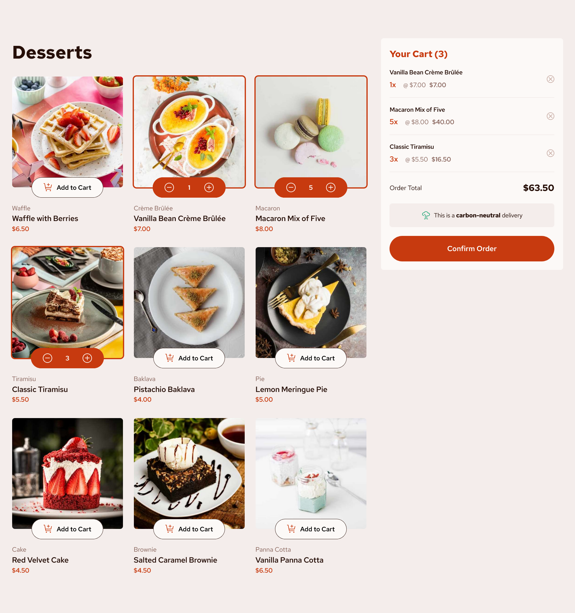

# Frontend Mentor - Product list with cart solution

This is a solution to the [Product list with cart challenge on Frontend Mentor](https://www.frontendmentor.io/challenges/product-list-with-cart-5MmqLVAp_d). Frontend Mentor challenges help you improve your coding skills by building realistic projects.

## Table of contents

- [Overview](#overview)
  - [The challenge](#the-challenge)
  - [Screenshot](#screenshot)
  - [Links](#links)
- [My process](#my-process)
  - [Built with](#built-with)
  - [What I learned](#what-i-learned)
- [Author](#author)

## Overview

### The challenge

Users should be able to:

- Add items to the cart and remove them
- Increase/decrease the number of items in the cart
- See an order confirmation modal when they click "Confirm Order"
- Reset their selections when they click "Start New Order"
- View the optimal layout for the interface depending on their device's screen size
- See hover and focus states for all interactive elements on the page

### Screenshot



### Links

- Solution URL: [https://github.com/josh76543210/Frontend-Mentor---Product-list-with-cart-solution---React](https://github.com/josh76543210/Frontend-Mentor---Product-list-with-cart-solution---React)
- Live Site URL: [https://josh76543210-fm-product-list-cart.netlify.app/](https://josh76543210-fm-product-list-cart.netlify.app/)

## My process

### Built with

- [Vite](https://vitejs.dev/)
- [React](https://reactjs.org/)

### What I learned

Refresh my react state management skills and improve my css grid technique.

```css
.productGrid {
  display: grid;
  grid-template-columns: 1fr;
  row-gap: calc((30 / 16) * 1rem);
}
```

```jsx
function DessertOrderDataProvider({ children }) {
  // use reducer function to simplify more complex data manipulation
  const [{ items, orderConfirmed }, dispatch] = useReducer(
    reducer,
    initialState
  );

  return (
    <DessertOrderDataContext.Provider
      value={{
        items,
        orderConfirmed,
        dispatch,
      }}
    >
      {children}
    </DessertOrderDataContext.Provider>
  );
}
DessertOrderDataProvider.propTypes = {
  children: PropTypes.node,
};
```

## Author

- GitHub - [@josh76543210](https://github.com/josh76543210)
- Frontend Mentor - [@josh76543210](https://www.frontendmentor.io/profile/josh76543210)
- Twitter - [@josh76543210](https://www.twitter.com/josh76543210)
